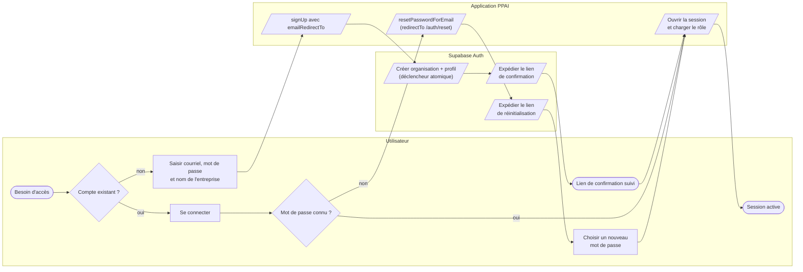
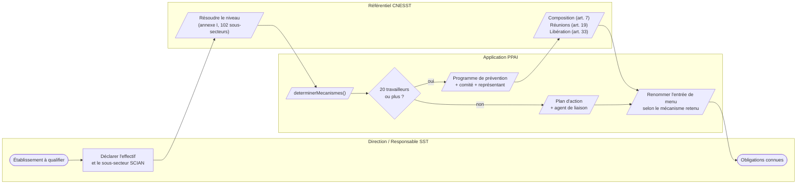
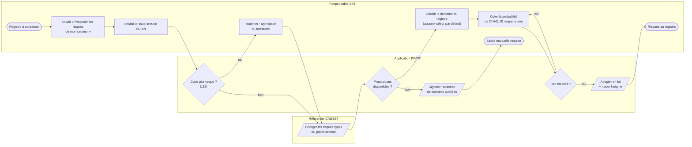
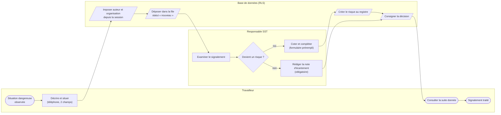
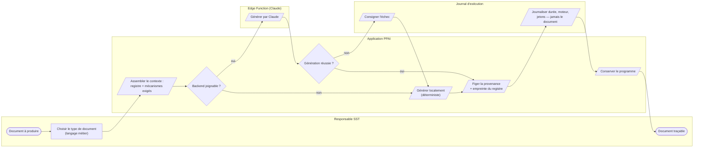
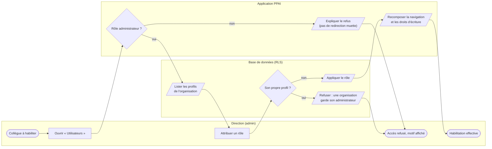

# Parcours PPAI — modélisation BPMN

> © 2026 Preventera — AgenticX5. Tous droits réservés. Voir `LICENSE.md`.

Six parcours, décrits en BPMN 2.0. Les fichiers `.bpmn` s'ouvrent dans
n'importe quel modeleur (Camunda Modeler, [bpmn.io](https://demo.bpmn.io),
Signavio) ; les diagrammes Mermaid ci-dessous se rendent directement ici.

Ces diagrammes ne sont pas décoratifs : ils décrivent le comportement
réellement implémenté, y compris les points où l'application **refuse**
d'agir à la place de l'employeur.

**Ne pas modifier ce fichier à la main** — il est produit par
`scripts/bpmn/generer_bpmn.py`. Corriger la description du processus dans
le script, puis régénérer.

## Vue d'ensemble

| Parcours | Acteurs | Fichier |
| --- | --- | --- |
| P1 — Accès et identité | Utilisateur · Application PPAI · Supabase Auth | [`acces-et-identite.bpmn`](acces-et-identite.bpmn) |
| P2 — Assujettissement réglementaire | Direction / Responsable SST · Application PPAI · Référentiel CNESST | [`assujettissement-reglementaire.bpmn`](assujettissement-reglementaire.bpmn) |
| P3 — Constitution du registre par propositions sectorielles | Responsable SST · Application PPAI · Référentiel CNESST | [`constitution-du-registre.bpmn`](constitution-du-registre.bpmn) |
| P4 — Signalement terrain et qualification | Travailleur · Responsable SST · Base de données (RLS) | [`signalement-terrain.bpmn`](signalement-terrain.bpmn) |
| P5 — Génération documentaire | Responsable SST · Application PPAI · Edge Function (Claude) · Journal d'exécution | [`generation-documentaire.bpmn`](generation-documentaire.bpmn) |
| P6 — Gestion des rôles | Direction (admin) · Application PPAI · Base de données (RLS) | [`gestion-des-roles.bpmn`](gestion-des-roles.bpmn) |

## P1 — Accès et identité

De la création de compte à la session ouverte, y compris la récupération d'un accès perdu. L'organisation et le profil sont créés par un déclencheur en base, de façon atomique : jamais un compte sans organisation propriétaire de ses données.

## P2 — Assujettissement réglementaire

Deux données déclarées — effectif et sous-secteur SCIAN — déterminent l'ensemble des obligations. Rien n'est demandé à l'utilisateur qui puisse être déduit : le seuil de 20 travailleurs et l'annexe I du RMPPÉ font le reste.

## P3 — Constitution du registre par propositions sectorielles

Les 258 risques types dérivés de 680 517 lésions sont proposés, jamais imposés. Le point dur du parcours est délibéré : aucune adoption sans que l'employeur ait coté la probabilité, risque par risque. Elle n'est pas dérivable des données ouvertes, et la Loi la met à sa charge (LSST art. 59).

## P4 — Signalement terrain et qualification

Le chaînon entre le terrain et le registre. On ne demande pas au témoin d'un danger de produire une analyse : il décrit, le responsable SST cote. Tout signalement reçoit une suite explicite — un signalement écarté sans explication décourage le suivant.

## P5 — Génération documentaire

Le moteur distant est tenté d'abord, le moteur local prend le relais en cas d'échec — la génération n'échoue jamais faute de réseau ou de clé. Quel que soit le chemin emprunté, la provenance réglementaire est figée dans le document : sources, version des textes, moteur réel.

## P6 — Gestion des rôles

Le masquage d'interface n'est pas la protection : la base refuse. Deux gardes s'appliquent en base, pas à l'écran — seul un administrateur modifie un rôle, et jamais le sien, pour qu'une organisation ne puisse pas perdre son dernier administrateur.

